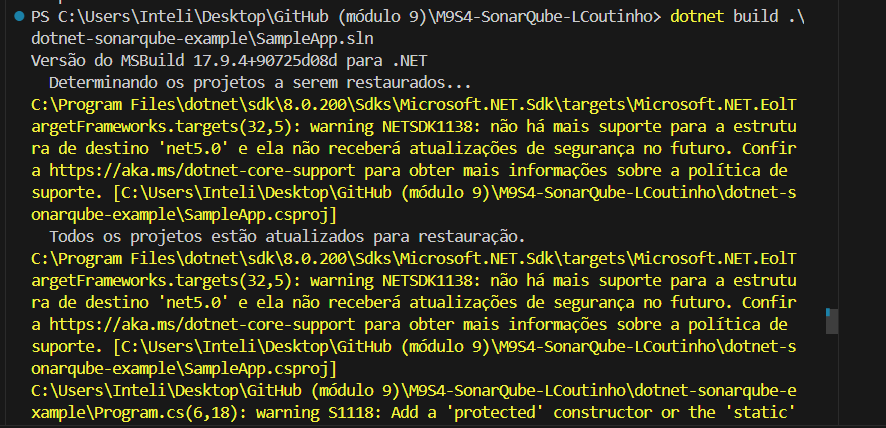

# Atividade - Realizando análise de código estático com sonarqube
## Semana 4 - Módulo 9 - Programação
### Livia Coutinho - Turma 3 - Engenharia de Software

## Introdução

Neste relatório será abordado o passo a passo da atividade da semana 4 em que foi implementado o SonarQube em um projeto .NET Core usando Docker, seguindo o tutorial "How to Write Cleaner, Safer Code with SonarQube, Docker and .NET Core" por Paweł Szydziak.

## Tecnologia e conceitos aprendidos
- SonarQube: ferramenta de análise de código que ajuda a melhorar a qualidade e a segurança do código. Ela avalia a saúde geral de uma aplicação, destaca problemas e bugs no código e facilita a alocação de tarefas para os programadores. Com o SonarQube, é possível definir um "Quality Gate" para manter um padrão aceitável de qualidade durante o desenvolvimento. Além disso, fornece insights sobre bugs, vulnerabilidades de segurança e duplicação de código.
- Docker: plataforma que simplifica o processo de desenvolvimento, implantação e execução de aplicativos em contêineres. Ele permite isolar aplicativos e suas dependências em contêineres, garantindo que eles funcionem consistentemente em diferentes ambientes.
- .NET Core: framework de desenvolvimento de software gratuito e de código aberto desenvolvido pela Microsoft. Ele é multiplataforma e suporta o desenvolvimento de aplicativos web, desktop e móveis.

## Resumo do tutorial
O tutorial mostra como configurar e usar o SonarQube em um projeto .NET Core com Docker. Os passos incluem:

- Preparação do ambiente
- Configuração do projeto de exemplo
- Execução do SonarQube em Docker
- Instalação do SonarScanner para .NET Core
- Análise do código

# Prints

- Download Java

- Git Clone

- Rodar SonarQube no Docker

- Instalar SonarScanner para o .NET Core

- Análise de código: dotnet sonarscanner begin /k:"project-key" /d:sonar.login=admin /d:sonar.password=admin

- Análise de código: dotnet build <path_to_solution.sln>

- Análise de código: dotnet sonarscanner end /d:sonar.login=admin /d:sonar.password=admin

- Login Sonar

- Análise resultado
